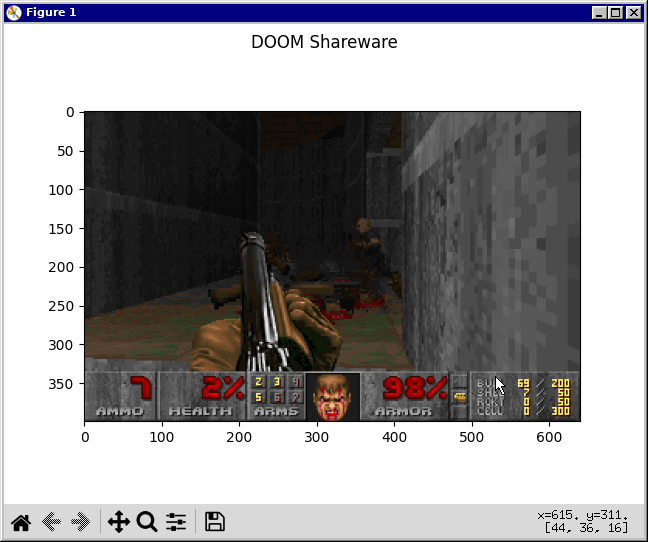
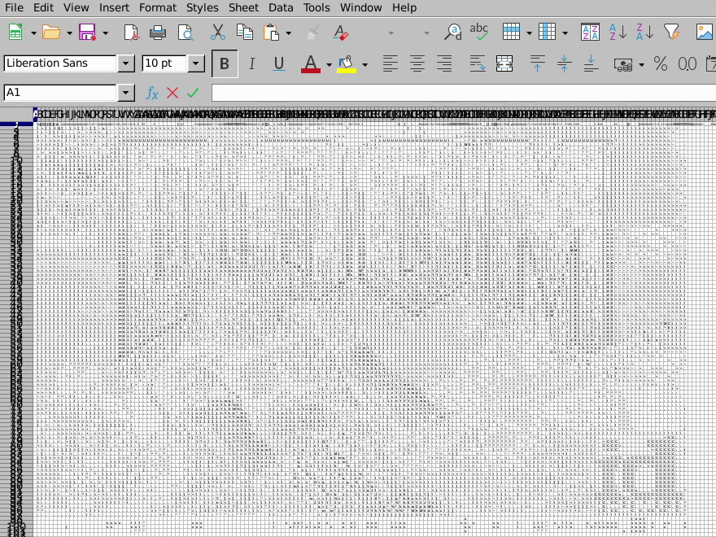
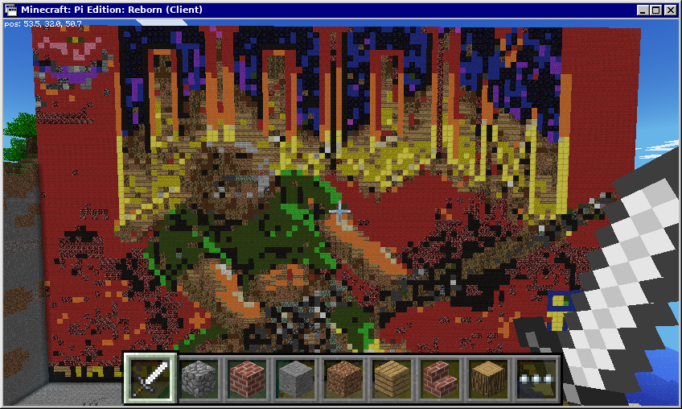
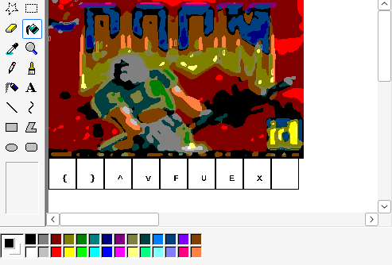
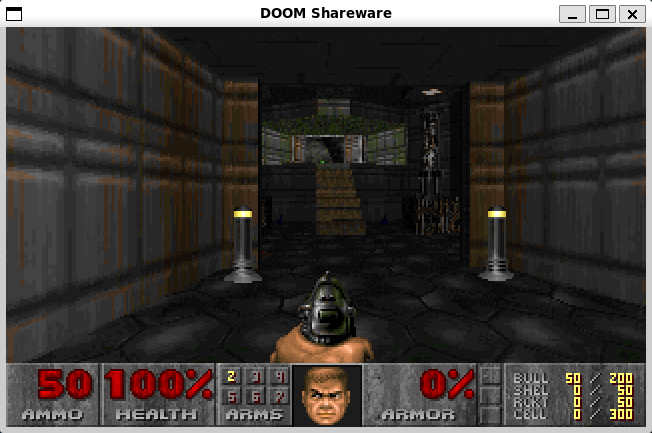

# cyDoomGeneric

Write doom ports in python!

Python bindings for [doomgeneric](https://github.com/ozkl/doomgeneric) with ease-of-use at heart.

To try it you will need a WAD file (game data). If you don't own the game, shareware version is freely available.

cyDoomGeneric should run on Linux, MacOS, and Windows.

## Porting

You must implement the `draw_frame` and `get_key` functions.

```python
import cydoomgeneric as cdg

resx = 640
resy = 400

# Required functions
def draw_frame(pixels: np.ndarray) -> None:
def get_key() -> Optional[tuple[int, int]]:

# Optional functions
def init() -> None:
def sleep_ms(ms: int) -> None:
def set_window_title(t: str) -> None:
def get_ticks_ms() -> int:

cdg.init(resx,
    resy,
    draw_frame,
    get_key,
    init=init,
    sleep_ms=sleep_ms,
    get_ticks_ms=get_ticks_ms,
    set_window_title=set_window_title)
cdg.main()  # Optional parameter argv=[...]
```

`get_key` should return `None` if all input has been processed, or a tuple `(pressed as 0 or 1, key)`. All possible keys are either members of the `Keys` enum, or the ascii value of the lowercase character `ord(c.lower())`.

If any function that was passed to `cdg.init` raises an exception during the execution of `cdg.main`, `sys.exit(1)` is called.

Some additional documentation can be found in `cydoomgeneric/cydoomgeneric.pyx`.

## Building

To build and install cydoomgeneric, run the following command:

```sh
pip install .
```

## Demo Screenshots

#### Pyplot


#### Libreoffice Calc


#### Minecraft: Pi Edition


#### MS Paint


#### Pygame


## Running the Demo

###### Before running any demo, perform the build process mentioned above

#### Pyplot

```sh
pip install '.[pyplot]'
python demo/demopyplot.py
```

#### Minecraft: Pi Edition

Before running the script, launch Minecraft: Pi Edition and join a world. The `SCALE` variable in `demo/demominepi.py` can be adjusted to change the display size.

To move, step on the appropriate block on the platform that the player is standing on. To press the fire, use, enter, or escape keys, hit (`RMB`) the appropriate block with the sword:
```
DIAMOND_BLOCK: FIRE
GOLD_BLOCK: USE
NETHER_REACTOR_CORE: ENTER
NETHER_REACTOR_CORE(active): ESCAPE
```

```sh
pip install '.[minepi]'
python demo/demominepi.py
```

#### MS Paint

Ensure that the Windows XP version of mspaint is installed, which can be done by running `winetricks mspaint`.

If you have not installed mspaint using wine, you'll have to edit the `PAINT_COMMAND` variable in `demo/demomspaint.py` to contain the command for launching paint.

If you wish to free your mouse in the middle of a frame being drawn, you should drag it to the top-left corner of the screen, which will free it, at which point you can kill the python script. Once a frame has been drawn, you will be able to send an input by flood-filling the appropriate "key" drawn under the frame.

```sh
pip install '.[mspaint]'
python demo/demomspaint.py
```

#### LibreOffice Calc

Ensure that the libreoffice SDK (`libreoffice-dev` on Debian) is installed, and that you're using the system python installation instead of a virtual environment.

The `SCALE` variable in `demo/democalc.py` can be adjusted in the range `[0,5]` to change the display size, idealy either 1 or 2. Lower scales will exponentially increase the setup time required prior to starting the game. Expect to wait a few minutes.

Sometimes the window will be tiny, so maximize it if neccessary. Also, you may experience unexpected issues while attempting to run this demo, and there's not much I can do because the UNO API has virtually no documentation and the code here has been pieced together from 10 year old forum posts for the Java or C++ version of the API.

Only run the following command once, unless the libreoffice process is killed:
```sh
libreoffice --nofirststartwizard --nologo --norestore --accept='socket,host=localhost,port=2002,tcpNoDelay=1;urp;StarOffice.ComponentContext' &
```

```sh
python demo/democalc.py
```

#### Pygame

```sh
pip install '.[pygame]'
python demo/demopygame.py
```

## License

```
Copyright (c) 2023-2024 Wojciech Graj

This program is free software; you can redistribute it and/or
modify it under the terms of the GNU General Public License
as published by the Free Software Foundation; either version 2
of the License, or (at your option) any later version.

This program is distributed in the hope that it will be useful,
but WITHOUT ANY WARRANTY; without even the implied warranty of
MERCHANTABILITY or FITNESS FOR A PARTICULAR PURPOSE.  See the
GNU General Public License for more details.
```
